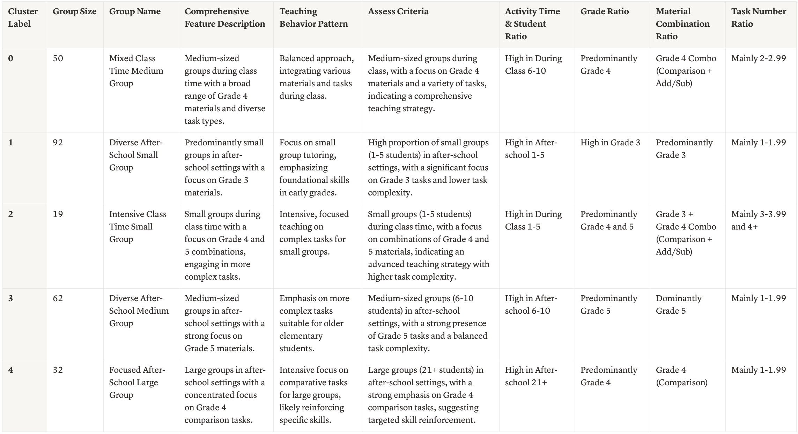

## 🧠 Cognitive Diagnosis Class Clustering & Interpretation

This project aims to uncover latent behavioral patterns across classes using data from Junyi's Cognitive Diagnosis system. The goal is to help the product team better understand classroom dynamics and teacher behaviors, ultimately supporting more effective marketing strategies tailored to different target audiences.

### 1. Summary

- Dataset consists of 401 records, reduced to 255 valid class entries after preprocessing
- Key features include: time slot of activity, class size, inferred grade level, task combinations, and number of assignments
- Used **K-modes** clustering tailored for categorical data
- Visualized results using **UMAP**
- Integrated **ChatGPT (gpt-4o)** to generate cluster names and summaries understandable by non-technical audiences.

### 2. Workflow
- `01_preprocessing.ipynb`: Clean raw data, perform feature engineering, and create categorical groupings for analysis.
- `02_kmodes_clustering.ipynb`: Apply K-modes clustering on processed categorical features. Evaluate cluster quality using cost and silhouette score.
- `03_clustering_interpretation.ipynb`: Visualize feature distribution by cluster and generate human-readable summaries using ChatGPT.

### 3. Folder Structure
```
cognitive_diagnosis_class_clustering/
├── data/
│   ├── class_analysis_raw_data.csv
│   ├── cleaned_class.csv
│   ├── encoded_class.csv
│   └── clustered_class.csv
├── image/
│   └──  sample_cluster_output.png
├── notebook/
│   ├── 01_preprocessing.ipynb
│   ├── 02_kmodes_clustering.ipynb
│   └── 03_clustering_interpretation.ipynb
└── README.md
```

### 4. Sample Output
Below is a sample cluster interpretation generated by GPT-4o based on the K-modes clustering results.


### 5. Limitations
- **K-modes instability**: K-modes is a non-deterministic algorithm. Even with fixed random seeds, results may vary across environments (e.g., Colab vs VS Code). To address this, we included the original results from Colab for reference and comparison. (Original results are available on [Notion](https://www.notion.so/junyiacademy/S2-2108e22e516480f9bce1e8589d67f80c).)
- **API key not included**: The GPT summary function requires an OpenAI API key. For security reasons, the key is not embedded in the code. Users must insert their own key manually before running the notebook.

### 6. Privacy Notice
To protect our users and intitutional privacy, all **personally identifiable information (PII)** has been removed or anonymized. This includes names, platform-specific identifiers (e.g., user_id, class_id, teacher_id), and any information that could indirectly lead to identification. Identifiers have been replaced with non-reversible sequential codes (e.g., class_1). 